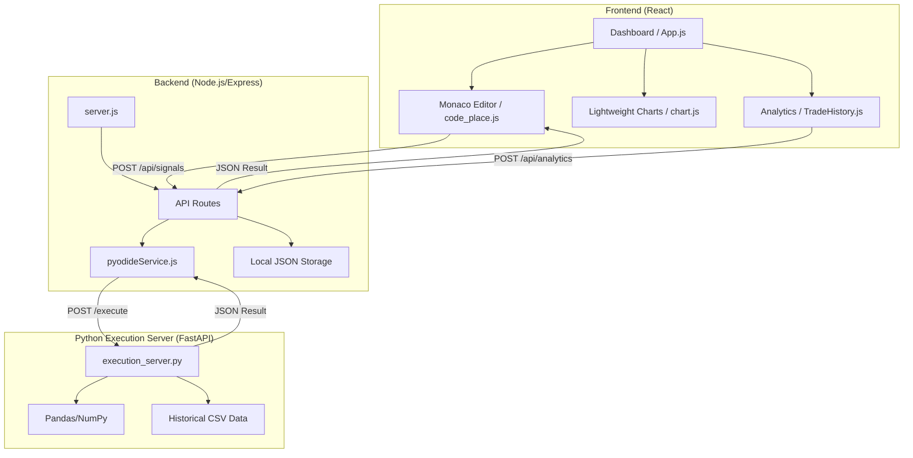

# Architecture

> Auto-generated by /map on 2026-04-01

## Overview

This project is a high-performance trading algorithm development and backtesting platform. It enables users to write Python-based trading strategies and technical indicators in a web interface, execute them against historical Forex data, and visualize the results (trades and indicator values) on a professional-grade financial chart.

### System Diagram

## Components

### Frontend (React)
- **Purpose:** User interface for code editing, chart visualization, and performance analytics.
- **Location:** `frontend/`
- **Key Files:**
    - `src/component/code_place.js`: Integrated Monaco editor for Python scripting.
    - `src/component/chart.js`: Lightweight-charts implementation with custom timeframe aggregation and marker/indicator overlays.
    - `src/component/TradeHistory.js`: Trade list display and integration with analytics API.

### Backend (Node.js)
- **Purpose:** API gateway, static file serving, and orchestrator for the Python execution environment.
- **Location:** `backend/`
- **Key Files:**
    - `server.js`: Express server initialization and child process management for the Python server.
    - `services/pyodideService.js`: Abstracted communication layer between Node and Python.
    - `routes/`: Modular API endpoints for signals, indicators, and analytics.

### Python Execution Server (FastAPI)
- **Purpose:** Isolated execution environment for user-provided Python scripts.
- **Location:** `backend/execution_server.py`
- **Features:** 
    - Eager loading of historical EURUSD M1 data into memory.
    - `exec()` based sandbox for running dynamic trading logic.
    - Seamless conversion between NumPy/Pandas types and JSON-compatible formats.

## Data Flow

1.  **Script Submission:** User writes a Python script (e.g., a Golden Cross strategy) in the frontend.
2.  **Request Handling:** The script is sent via HTTP POST to the Node.js backend.
3.  **Cross-Language Execution:** Node.js forwards the script to the FastAPI server running on localhost:8000.
4.  **Data Processing:** The Python server injects the pre-loaded DataFrame (`df`) and other variables (`time`, `open`, `close`, etc.) into the script's namespace and executes it.
5.  **Result Aggregation:** The script populates a `trades` list or `indicators` list, which is returned as JSON.
6.  **Visualization:** The frontend receives the JSON, normalizes the data, and updates the chart with markers (Buy/Sell) and line series (Indicators).

## Integration Points

| Service | Type | Purpose |
|---------|------|---------|
| Python Server | HTTP/Local | Runs heavy data processing and user scripts via FastAPI |
| CSV Data | File System | Source of historical OHLCV data (EURUSD M1 2025) |
| JSON Storage | File System | Persists user-saved indicators and algorithm metadata |

## Technical Debt

- [ ] **Sandboxing:** Current execution uses `exec()` which is vulnerable if exposed to untrusted input (currently limited to localhost).
- [ ] **Data Scalability:** Entire dataset is loaded into memory; may need chunking or a database for larger history.
- [ ] **Error Handling:** Tracebacks are returned to the frontend but could be formatted more cleanly for the user.
- [ ] **State Sync:** Large payloads (50MB limit) suggest potential bottlenecks for high-frequency indicator data.

## Conventions

**Naming:** PascalCase for React components, snake_case for Python variables, camelCase for JavaScript variables and API routes.
**Structure:** Modular routes and services in the backend; component-based architecture in the frontend.
**Testing:** Jest and Testing Library used in the frontend; no formal tests observed in the backend yet.
